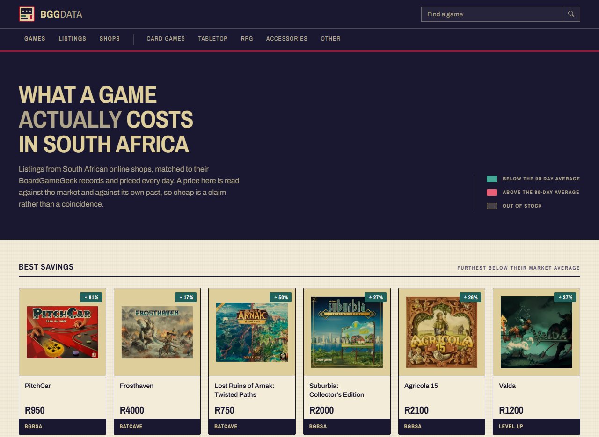
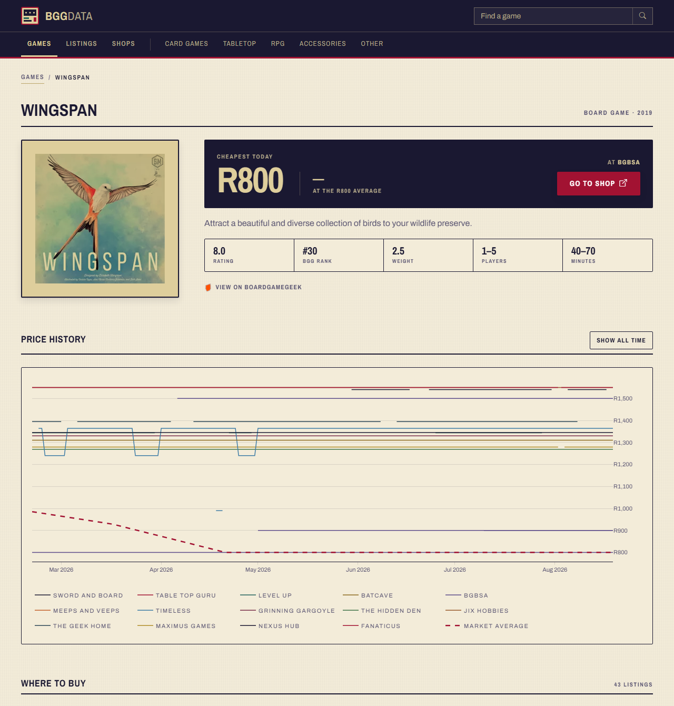

# BGG Data

**What a game actually costs in South Africa.**

Live at **[bggdata.co.za](https://bggdata.co.za)**

BGG Data tracks board game prices across South African online shops, matches every
listing to its [BoardGameGeek](https://boardgamegeek.com) record, and records the price
every day. That history is what makes "cheap" a claim rather than a coincidence — a price
is shown against the market and against its own past, not on its own.

## What it does

- **Finds the cheapest shop today.** Every game page leads with the lowest current price,
  which shop it is at, and how far that sits below (or above) the 90-day market average.
- **Keeps the price history.** Each listing is priced daily, so a game's page shows every
  shop's line over time plus a rolling market average.
- **Covers the market.** 17 shop scrapers (13 currently live), joined to BGG identity so
  the same game across different shops is genuinely the same game.
- **Browsable by category.** Board games, card games, tabletop, RPG, accessories, bundles
  and other.
- **No accounts, no ads, no affiliate links.** It is anonymous and free, and every
  outbound shop link is a plain link.

Price history for Wingspan across fourteen shops, with the market average dashed in red:

## How it works

Per-shop scrapers pull listings and prices, each scrape logged. Listings are matched to
BGG games (ratings, rank, weight, player counts, play time come along with the match).
Every listing gets a price recorded against a day, giving each game a price series and a
90-day rolling average. Views are cached for ten minutes and the graphs are rendered
server-side.

## Tech stack

| | |
|---|---|
| Backend | Django 5.1 on Python 3.11+ |
| Data | SQLite (>1 GB of price history) |
| Frontend | Server-rendered Django templates, Bootstrap 5.3, htmx — no SPA |
| Tables & filters | django-tables2, django-filter |
| Graphs | Plotly, rendered server-side |
| Scraping | requests, BeautifulSoup, Botasaurus |
| Hosting | DigitalOcean, deployed by GitHub Actions on a `v*` tag |

## Notes

This site is not affiliated with BoardGameGeek — it consumes BGG data and links back to
it. Prices are scraped and therefore imperfect: a shop's own site is always the final
word, which is where every link on this site ends up.
